# Olist Analytics

End-to-end analytics pipeline built on the Brazilian Olist e-commerce dataset (100k+ orders, 8 tables).
Demonstrates ingestion, data quality gates, SQL transformation, and a BI dashboard — fully orchestrated.

## Stack


| Tool                                        | Role                                                 |
| ------------------------------------------- | ---------------------------------------------------- |
| [DuckDB](https://duckdb.org)                | Embedded OLAP storage & compute                      |
| [dbt](https://docs.getdbt.com) + dbt-duckdb | SQL transformations (staging → intermediate → marts) |
| [Soda Core](https://docs.soda.io)           | Operational data quality checks                      |
| [Dagster](https://dagster.io)               | Pipeline orchestration, daily schedule               |
| [Evidence](https://evidence.dev)            | Markdown-based BI dashboard                          |
| [Marimo](https://marimo.io)                 | Interactive Python notebooks                         |
| uv                                          | Python package manager                               |
| Ruff + SQLFluff                             | Python & SQL linting                                 |


## Quick Start

```bash
uv sync                                    # install dependencies
uv run python main.py ingest               # load CSVs → DuckDB
uv run python main.py transform            # dbt build (run + test)
uv run python main.py quality              # Soda checks (sources + marts)
uv run python main.py dagster              # launch Dagster UI → http://localhost:3000
```

Full setup guide (prerequisites, dataset download, dashboard): `[docs/SETUP.md](docs/SETUP.md)`

## 🔁 Pipeline Flow

The end-to-end pipeline is orchestrated by **Dagster** and scheduled daily at 06:00 UTC. Each asset depends on the previous one — if a step fails, the pipeline stops and surfaces the error in the Dagster UI.

```mermaid
flowchart TD
    %% ── Data Sources ──
    subgraph SRC["☁️ Data Source"]
        K["Kaggle Olist Dataset\n8 CSV files · 100k+ orders"]
    end

    %% ── Ingestion ──
    subgraph ING["1️⃣ Ingestion"]
        S1["ingest_csv_to_parquet.py\nPython + DuckDB"]
        DB1[("DuckDB\ndata/olist.duckdb\n8 raw_* tables")]
    end

    %% ── Source Quality ──
    subgraph SQ["2️⃣ Source Quality Gates"]
        SODA1["Soda Core\nchecks/sources/"]
        SQ_CHECKS["✅ Row counts & volumes\n✅ PK uniqueness & not-null\n✅ Domain validity\n✅ Cross-table reconciliation\n✅ Outlier warnings"]
    end

    %% ── dbt Transformation ──
    subgraph DBT["3️⃣ dbt Transformation"]
        direction TB
        subgraph STG["Staging (views)"]
            S_ORD["stg_orders"]
            S_ITM["stg_order_items"]
            S_PAY["stg_payments"]
            S_REV["stg_reviews"]
            S_CUS["stg_customers"]
            S_PRD["stg_products"]
            S_SEL["stg_sellers"]
            S_GEO["stg_geolocation"]
        end

        subgraph INT["Intermediate (views)"]
            I_ENR["int_orders_enriched\n• Joins 5 staging models\n• Primary payment type\n• Review dedup"]
            I_DEL["int_delivery_performance\n• Seller × state aggregates\n• P95 delivery days\n• Late delivery %"]
        end

        subgraph MRT["Marts (tables)"]
            M_REV["mart_daily_revenue\n• Date spine gap-fill\n• Daily/weekly/monthly grains"]
            M_RFM["mart_customer_rfm\n• RFM scoring (NTILE)\n• 7 customer segments"]
            M_DEL["mart_delivery_analysis\n• Delivery buckets\n• Satisfaction impact"]
            M_PRD["mart_product_analytics\n• Revenue rank\n• Freight % of price"]
            M_SEL["mart_seller_performance\n• Seller tiering\n• Volume + satisfaction"]
        end

        DBT_TEST["dbt tests\n• unique / not_null\n• relationships (FK)\n• accepted_values\n• dbt_expectations ranges"]
    end

    %% ── Mart Quality ──
    subgraph MQ["4️⃣ Mart Quality Gates"]
        SODA2["Soda Core\nchecks/marts/"]
        MQ_CHECKS["✅ Time-series volume\n✅ Business key not-null\n✅ Avg order value range\n✅ Valid RFM segments\n✅ Seller tier whitelist\n✅ % bounds (0–100)"]
    end

    %% ── Dashboard ──
    subgraph DASH["5️⃣ BI Dashboard"]
        EV["Evidence.dev\nevidence-report/"]
        EV_PAGES["📊 Monthly revenue trend\n📊 Delivery → satisfaction\n📊 RFM segmentation\n📊 Top 15 categories"]
    end

    %% ── CI/CD ──
    subgraph CI["⚙️ CI/CD"]
        GHA["GitHub Actions\n.github/workflows/ci.yml"]
        LINT["Ruff (Python)\nSQLFluff (SQL)\npre-commit hooks"]
    end

    %% ── Orchestration ──
    subgraph ORCH["🎛️ Orchestration"]
        DAG["Dagster\npipeline/definitions.py\nDaily schedule: 0 6 * * *"]
    end

    %% ── Exploration ──
    subgraph EXPL["📓 Exploration"]
        MAR["Marimo notebook\nnotebooks/01_exploration.py"]
    end

    %% ── Flow ──
    K --> S1
    S1 --> DB1
    DB1 --> SODA1
    SODA1 --> SQ_CHECKS
    SQ_CHECKS -->|pass| STG
    STG --> INT
    INT --> MRT
    MRT --> DBT_TEST
    DBT_TEST -->|pass| SODA2
    SODA2 --> MQ_CHECKS
    MQ_CHECKS -->|pass| EV
    EV --> EV_PAGES

    %% Orchestration controls the flow
    DAG -.->|orchestrates| S1
    DAG -.->|orchestrates| SODA1
    DAG -.->|orchestrates| DBT_TEST
    DAG -.->|orchestrates| SODA2
    DAG -.->|orchestrates| EV

    %% CI validates on push
    GHA -.->|on push/PR| S1
    GHA -.->|on push/PR| LINT

    %% Exploration reads from DB
    DB1 -.-> MAR

    %% Styling
    classDef source fill:#fef3c7,stroke:#f59e0b,color:#92400e
    classDef ingest fill:#dbeafe,stroke:#3b82f6,color:#1e3a5f
    classDef quality fill:#dcfce7,stroke:#22c55e,color:#166534
    classDef dbt fill:#e0e7ff,stroke:#6366f1,color:#312e81
    classDef mart fill:#fce7f3,stroke:#ec4899,color:#831843
    classDef dash fill:#f3e8ff,stroke:#a855f7,color:#581c87
    classDef orch fill:#fef9c3,stroke:#eab308,color:#713f12
    classDef ci fill:#f1f5f9,stroke:#64748b,color:#334155

    class K source
    class S1,DB1 ingest
    class SODA1,SQ_CHECKS,SODA2,MQ_CHECKS quality
    class S_ORD,S_ITM,S_PAY,S_REV,S_CUS,S_PRD,S_SEL,S_GEO,I_ENR,I_DEL,DBT_TEST dbt
    class M_REV,M_RFM,M_DEL,M_PRD,M_SEL mart
    class EV,EV_PAGES dash
    class DAG orch
    class GHA,LINT ci

```




### Pipeline Steps Detail


| Step                   | Asset (Dagster)         | Tool             | What Happens                                                                                                      |
| ---------------------- | ----------------------- | ---------------- | ----------------------------------------------------------------------------------------------------------------- |
| **1 — Ingestion**      | `raw_parquet_files`     | Python + DuckDB  | 8 Kaggle CSVs → `CREATE TABLE` into `data/olist.duckdb` as `raw_`* tables                                         |
| **2 — Source Quality** | `source_quality_checks` | Soda Core        | 30+ checks: row counts, PK/FK integrity, domain validity, cross-table reconciliation (payment vs. item totals)    |
| **3 — Transformation** | `dbt_models`            | dbt + dbt-duckdb | `dbt run` builds 8 staging views → 2 intermediate views → 5 mart tables, then `dbt test` runs schema + data tests |
| **4 — Mart Quality**   | `mart_quality_checks`   | Soda Core        | 40+ checks on mart tables: KPI plausibility, business key completeness, segment/tier whitelists                   |
| **5 — Dashboard**      | `evidence_build`        | Evidence.dev     | `npm run build` generates a static BI dashboard from SQL queries over the marts                                   |


### dbt Model Lineage


### Data Quality Architecture

The project enforces quality at **three checkpoints** — before, during, and after transformation:

```
CSV files
  │
  ▼
┌─────────────────────────┐
│  SODA — Source Checks   │  checks/sources/  ·  30+ checks
│  • Row counts & volume  │  • PK uniqueness
│  • Domain validation    │  • Cross-table reconciliation
│  • Outlier warnings     │  • Documented threshold decisions
└────────────┬────────────┘
             │ pass
             ▼
┌─────────────────────────┐
│  dbt — Model Tests      │  _staging.yml, _intermediate.yml, _marts.yml
│  • unique / not_null    │  • relationships (FK integrity)
│  • accepted_values      │  • dbt_expectations (value ranges)
└────────────┬────────────┘
             │ pass
             ▼
┌─────────────────────────┐
│  SODA — Mart Checks     │  checks/marts/  ·  40+ checks
│  • KPI plausibility     │  • Segment whitelists
│  • Business key nulls   │  • Percentage bounds (0–100)
│  • Time-series volume   │  • Avg order value range
└─────────────────────────┘

```

Threshold decisions are documented in `checks/sources/decisions.md`, explaining **why** each tolerance was chosen (e.g., 789 duplicate `review_id` values tolerated as a known dataset artifact).

### Tech Stack Map

```
┌───────────────────────────────────────────────────────┐
│                    ORCHESTRATION                       │
│              Dagster · daily @ 06:00 UTC               │
├─────────┬──────────┬──────────┬──────────┬────────────┤
│ Ingest  │ Quality  │Transform │ Quality  │ Dashboard  │
│ Python  │ Soda     │ dbt +    │ Soda     │ Evidence   │
│ DuckDB  │ Core     │ duckdb   │ Core     │ .dev       │
├─────────┴──────────┴──────────┴──────────┴────────────┤
│                     STORAGE                            │
│            DuckDB  ·  data/olist.duckdb                │
├───────────────────────────────────────────────────────┤
│                    DEV TOOLS                           │
│  uv (packages) · Ruff + SQLFluff (lint) · pre-commit  │
│  GitHub Actions (CI) · Marimo (exploration)            │
└───────────────────────────────────────────────────────┘

```


## CLI

`main.py` provides a unified entry point:

```bash
uv run python main.py ingest      # CSV → DuckDB raw tables
uv run python main.py quality     # Soda scans on sources + marts
uv run python main.py transform   # dbt build (run + test)
uv run python main.py pipeline    # ingest + quality + transform
uv run python main.py dagster     # start Dagster UI
```

## Data Quality

Two complementary layers:


| Layer         | Tool      | When                        |
| ------------- | --------- | --------------------------- |
| Source checks | Soda Core | After ingestion, before dbt |
| Model tests   | dbt       | During `dbt build`          |
| Mart checks   | Soda Core | After dbt build             |


**Soda** covers: row counts, PK/FK integrity, domain validity, cross-table reconciliation.
**dbt tests** cover: uniqueness, referential integrity, accepted values, value ranges.

Documented threshold decisions: `[checks/sources/decisions.md](checks/sources/decisions.md)`
Detailed strategy: `[docs/data-quality.md](docs/data-quality.md)`

## Quality Runbook

```bash
# Soda — sources
uv run soda scan -d duckdb_raw -c soda/config.yml checks/sources/

# dbt — run + test
uv run dbt build --project-dir olist_dbt/

# Soda — marts
uv run soda scan -d duckdb_raw -c soda/config.yml checks/marts/
```

## Dashboard (Evidence)

```bash
cd evidence-report
npm install && npm run sources && npm run dev   # → http://localhost:3000
```

## Orchestration (Dagster)

Pipeline: `ingestion → source checks → dbt build → mart checks → Evidence build`

```bash
uv run python main.py dagster
# or directly:
uv run dagster dev -m pipeline.definitions
```

## Lineage (dbt docs)

```bash
uv run dbt docs generate --project-dir olist_dbt/
uv run dbt docs serve --project-dir olist_dbt/   # → http://localhost:8080
```

This opens the interactive DAG showing the full lineage:
`stg_orders → int_orders_enriched → mart_delivery_analysis`

A screenshot of the lineage graph is available in `[docs/lineage.png](docs/lineage.png)` for reviewers who cannot run the project locally.

## Linting

```bash
uv run ruff check . --fix              # Python
uv run sqlfluff fix olist_dbt/models/  # SQL
uvx pre-commit run --all-files         # both via pre-commit
```

