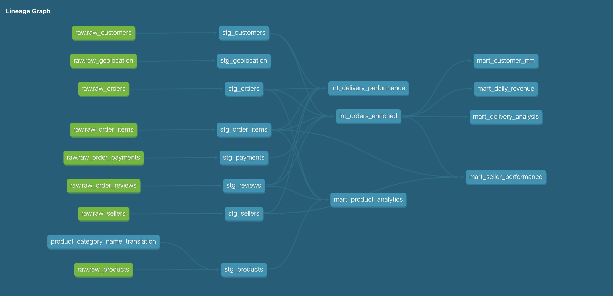

```mermaid
flowchart TD
    %% ── Data Sources ──
    subgraph SRC["☁️ Data Source"]
        K["Kaggle Olist Dataset\n8 CSV files · 100k+ orders"]
    end

    %% ── Ingestion ──
    subgraph ING["1️⃣ Ingestion"]
        S1["ingest_csv_to_parquet.py\nPython + DuckDB"]
        DB1[("DuckDB\ndata/olist.duckdb\n8 raw_* tables")]
    end

    %% ── Source Quality ──
    subgraph SQ["2️⃣ Source Quality Gates"]
        SODA1["Soda Core\nchecks/sources/"]
        SQ_CHECKS["✅ Row counts & volumes\n✅ PK uniqueness & not-null\n✅ Domain validity\n✅ Cross-table reconciliation\n✅ Outlier warnings"]
    end

    %% ── dbt Transformation ──
    subgraph DBT["3️⃣ dbt Transformation"]
        direction TB
        subgraph STG["Staging (views)"]
            S_ORD["stg_orders"]
            S_ITM["stg_order_items"]
            S_PAY["stg_payments"]
            S_REV["stg_reviews"]
            S_CUS["stg_customers"]
            S_PRD["stg_products"]
            S_SEL["stg_sellers"]
            S_GEO["stg_geolocation"]
        end

        subgraph INT["Intermediate (views)"]
            I_ENR["int_orders_enriched\n• Joins 5 staging models\n• Primary payment type\n• Review dedup"]
            I_DEL["int_delivery_performance\n• Seller × state aggregates\n• P95 delivery days\n• Late delivery %"]
        end

        subgraph MRT["Marts (tables)"]
            M_REV["mart_daily_revenue\n• Date spine gap-fill\n• Daily/weekly/monthly grains"]
            M_RFM["mart_customer_rfm\n• RFM scoring (NTILE)\n• 7 customer segments"]
            M_DEL["mart_delivery_analysis\n• Delivery buckets\n• Satisfaction impact"]
            M_PRD["mart_product_analytics\n• Revenue rank\n• Freight % of price"]
            M_SEL["mart_seller_performance\n• Seller tiering\n• Volume + satisfaction"]
        end

        DBT_TEST["dbt tests\n• unique / not_null\n• relationships (FK)\n• accepted_values\n• dbt_expectations ranges"]
    end

    %% ── Mart Quality ──
    subgraph MQ["4️⃣ Mart Quality Gates"]
        SODA2["Soda Core\nchecks/marts/"]
        MQ_CHECKS["✅ Time-series volume\n✅ Business key not-null\n✅ Avg order value range\n✅ Valid RFM segments\n✅ Seller tier whitelist\n✅ % bounds (0–100)"]
    end

    %% ── Dashboard ──
    subgraph DASH["5️⃣ BI Dashboard"]
        EV["Evidence.dev\nevidence-report/"]
        EV_PAGES["📊 Monthly revenue trend\n📊 Delivery → satisfaction\n📊 RFM segmentation\n📊 Top 15 categories"]
    end

    %% ── CI/CD ──
    subgraph CI["⚙️ CI/CD"]
        GHA["GitHub Actions\n.github/workflows/ci.yml"]
        LINT["Ruff (Python)\nSQLFluff (SQL)\npre-commit hooks"]
    end

    %% ── Orchestration ──
    subgraph ORCH["🎛️ Orchestration"]
        DAG["Dagster\npipeline/definitions.py\nDaily schedule: 0 6 * * *"]
    end

    %% ── Exploration ──
    subgraph EXPL["📓 Exploration"]
        MAR["Marimo notebook\nnotebooks/01_exploration.py"]
    end

    %% ── Flow ──
    K --> S1
    S1 --> DB1
    DB1 --> SODA1
    SODA1 --> SQ_CHECKS
    SQ_CHECKS -->|pass| STG
    STG --> INT
    INT --> MRT
    MRT --> DBT_TEST
    DBT_TEST -->|pass| SODA2
    SODA2 --> MQ_CHECKS
    MQ_CHECKS -->|pass| EV
    EV --> EV_PAGES

    %% Orchestration controls the flow
    DAG -.->|orchestrates| S1
    DAG -.->|orchestrates| SODA1
    DAG -.->|orchestrates| DBT_TEST
    DAG -.->|orchestrates| SODA2
    DAG -.->|orchestrates| EV

    %% CI validates on push
    GHA -.->|on push/PR| S1
    GHA -.->|on push/PR| LINT

    %% Exploration reads from DB
    DB1 -.-> MAR

    %% Styling
    classDef source fill:#fef3c7,stroke:#f59e0b,color:#92400e
    classDef ingest fill:#dbeafe,stroke:#3b82f6,color:#1e3a5f
    classDef quality fill:#dcfce7,stroke:#22c55e,color:#166534
    classDef dbt fill:#e0e7ff,stroke:#6366f1,color:#312e81
    classDef mart fill:#fce7f3,stroke:#ec4899,color:#831843
    classDef dash fill:#f3e8ff,stroke:#a855f7,color:#581c87
    classDef orch fill:#fef9c3,stroke:#eab308,color:#713f12
    classDef ci fill:#f1f5f9,stroke:#64748b,color:#334155

    class K source
    class S1,DB1 ingest
    class SODA1,SQ_CHECKS,SODA2,MQ_CHECKS quality
    class S_ORD,S_ITM,S_PAY,S_REV,S_CUS,S_PRD,S_SEL,S_GEO,I_ENR,I_DEL,DBT_TEST dbt
    class M_REV,M_RFM,M_DEL,M_PRD,M_SEL mart
    class EV,EV_PAGES dash
    class DAG orch
    class GHA,LINT ci

```

# Olist Analytics

End-to-end analytics engineering project on the Brazilian Olist e-commerce dataset (100k+ orders, 8 source tables), showcasing ingestion, quality gates, SQL modeling, orchestration, and BI delivery.

## Portfolio Highlights

- Built a production-style analytics workflow from raw CSV files to an executive-ready BI layer.
- Implemented three-layer quality assurance: Soda source checks, dbt model tests, Soda mart checks.
- Modeled analytics data into staging, intermediate, and marts for reliable downstream reporting.
- Orchestrated daily execution in Dagster with explicit asset dependencies and failure visibility.
- Published business-focused dashboard outputs with Evidence over DuckDB marts.

## At a Glance

| Area | Details |
| --- | --- |
| Dataset | Olist e-commerce data, 8 CSV files, 100k+ orders |
| Outcomes | Revenue trends, delivery insights, RFM segmentation, seller and product analytics |
| Reliability | Source + transformation + mart quality controls with documented thresholds |
| Orchestration | Dagster asset pipeline, scheduled daily at 06:00 UTC |

## Stack

| Tool | Role |
| --- | --- |
| [DuckDB](https://duckdb.org) | Embedded OLAP storage and compute |
| [dbt](https://docs.getdbt.com) + dbt-duckdb | SQL transformations and tests |
| [Soda Core](https://docs.soda.io) | Operational data quality checks |
| [Dagster](https://dagster.io) | Pipeline orchestration and scheduling |
| [Evidence](https://evidence.dev) | Markdown-based BI dashboard |
| [Marimo](https://marimo.io) | Interactive analysis notebooks |
| uv | Python package management |
| Ruff + SQLFluff | Python and SQL linting |

## Pipeline Flow

The end-to-end flow is orchestrated by Dagster. Each step must pass before the next begins.



## dbt Model Lineage



## Quick Start

```bash
uv sync
uv run python main.py ingest
uv run python main.py transform
uv run python main.py quality
uv run python main.py dagster
```

Full environment and dataset setup: [`docs/SETUP.md`](docs/SETUP.md)

## Run and Validate

```bash
# Full pipeline
uv run python main.py pipeline

# Dashboard (local)
cd evidence-report
npm install
npm run sources
npm run dev

# Linting
uv run ruff check . --fix
uv run sqlfluff fix olist_dbt/models/
uvx pre-commit run --all-files
```

## Data Quality Strategy

| Layer | Tool | Purpose |
| --- | --- | --- |
| Source checks | Soda Core | Validate raw ingestion quality before transformations |
| Model tests | dbt | Enforce schema correctness and relational integrity during build |
| Mart checks | Soda Core | Validate KPI plausibility and business-rule compliance |

Threshold rationale is documented in [`checks/sources/decisions.md`](checks/sources/decisions.md).

## Deep Dive

- Setup and local runbook: [`docs/SETUP.md`](docs/SETUP.md)
- Quality architecture and rationale: [`docs/data-quality.md`](docs/data-quality.md)
- Threshold decisions for source checks: [`checks/sources/decisions.md`](checks/sources/decisions.md)
